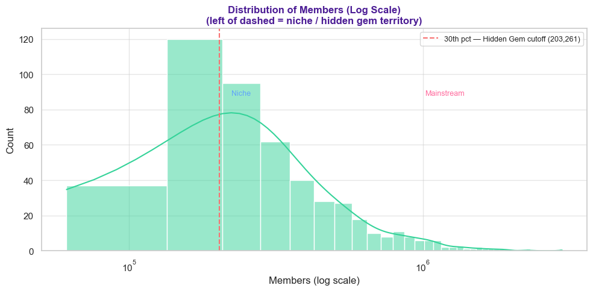
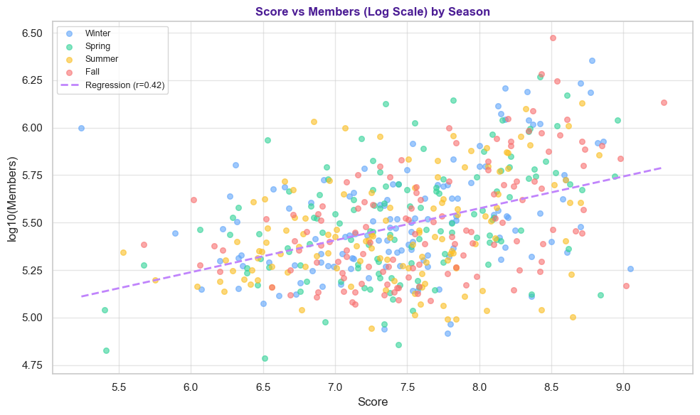
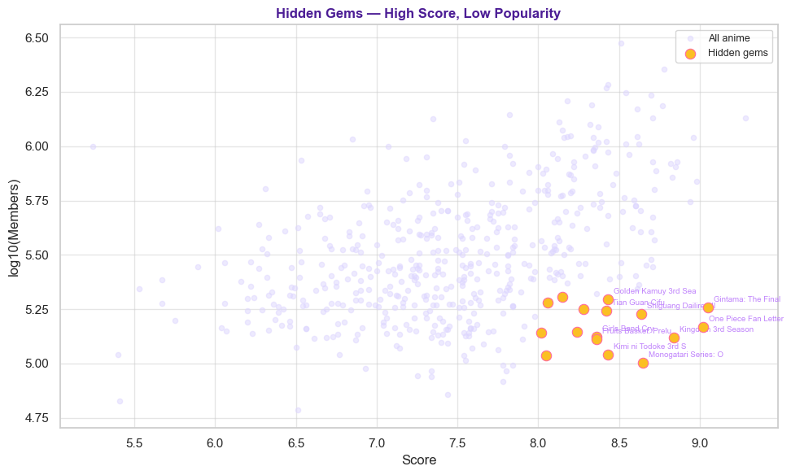
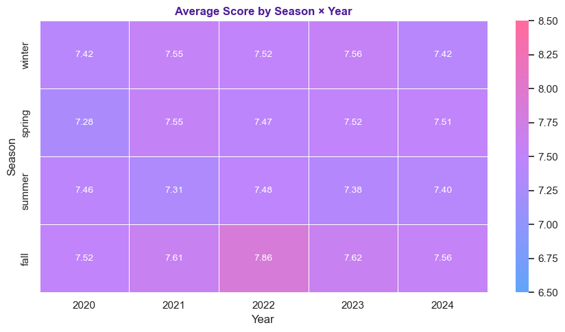
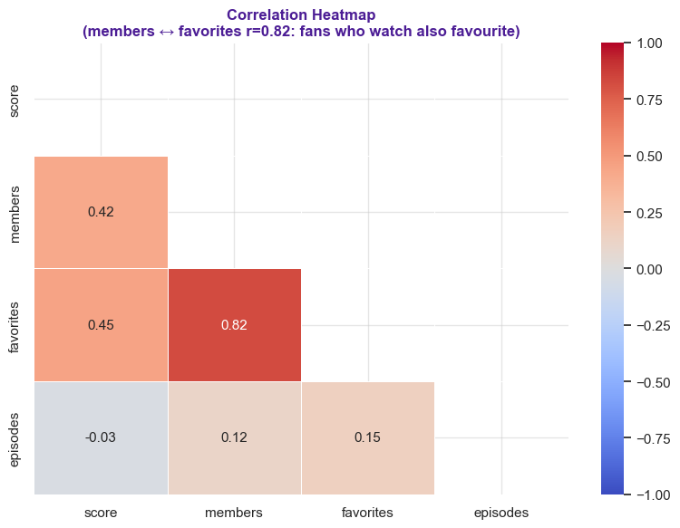

# AnimeRadar

**Can we separate genuine quality from mere popularity — and find the good shows nobody watched?**

An exploratory data analysis of **500 anime titles (2020–2024)** from the Jikan / MyAnimeList API. AnimeRadar ranks seasonal releases, tests whether "fall is the prestige season" holds up statistically, and surfaces **hidden gems**: highly rated titles with unusually small audiences.

Graduate group project — UMBC **DATA 601**.

---

## The problem

Every anime season drops 40–60 new titles. Early user ratings are volatile and hype-driven, and the shows that surface on any platform are usually the ones that were *already* popular. Quality and visibility get conflated.

So: **does a high score actually mean a large audience?** And if not, which good shows are being missed?

---

## Key findings

| Finding | Result |
|---|---|
| Score ↔ audience size | **Pearson r = 0.42** (p < 0.001) — positive, but only moderate |
| Fall vs. spring scores | **No significant difference** (t = 1.84, **p = 0.067**) |
| Members ↔ favorites | **r = 0.82** — near-collinear |
| Episode count ↔ score | **r = −0.03** — no relationship |
| Top-ranked title | *Sousou no Frieren* (9.28) |
| Hidden gems found | *Gintama: The Final* (9.05), *One Piece Fan Letter* (9.02) |

**The headline:** rating explains only a minority of the variance in reach. A great show is *not* guaranteed an audience — which is exactly what makes a hidden-gem search worth doing.

And the "fall is the prestige season" belief? Fall does score higher on average (7.63 vs 7.47 for spring), but the difference **isn't statistically significant**. It's folk wisdom, not a fact.

---

## Selected visualizations

### Audience size is severely right-skewed
Plotting membership linearly would crush 90% of the dataset into a spike near zero. On a log axis the real structure appears, and the 30th-percentile cutoff used for hidden-gem detection becomes something you can *see* rather than something asserted.



### Quality predicts reach — but only moderately
The regression is positive and significant, and the scatter is wide. This is the central result of the project.



### The hidden gems
Applying the filter surfaces a tight cluster: highly rated titles sitting far left of the popularity distribution. These are the actionable output — the shows a popularity-driven recommender would never put in front of you.



### Season has little effect on quality
Variation is year-driven, not season-driven. No stable seasonal advantage across the five-year window.



### Correlation structure
Members and favorites are near-collinear — engaged fans both watch *and* favorite the same titles. Episode count is unrelated to quality.



---

## Method

**Data.** 500 titles from the Jikan API (MyAnimeList), 2020–2024. Balanced *by design*: 100 per year, 125 per season — so seasonal and yearly comparisons aren't confounded by unequal sample sizes.

**Pipeline.** Ingest raw JSON → drop unreleased titles → handle missing values → normalize genre labels → filter incomplete records → min-max normalize `members` and `favorites`.

**Weighted Ranking System (WRS).**
```
final_score = 0.6 × score + 0.25 × members_norm + 0.15 × favorites_norm
```
Note what this does: it *blends* rating with engagement. It answers **"what is both good and widely watched"** — not "what is good regardless of reach." It rewards popularity by construction.

**Hidden-gem detection.**
```
score ≥ 8.0  AND  members ≤ 30th percentile  (≈ 203,000 members)
```
*This* is the mechanism that isolates quality from exposure, and it is deliberately separate from the ranking above. The two answer different questions.

**Statistical tests.** Shapiro–Wilk (normality), independent t-test (fall vs. spring), Pearson correlation (score vs. members, log-transformed).

---

## Outputs

| File | Contents |
|---|---|
| `outputs/top10_anime.csv` | Top 10 titles by weighted ranking |
| `outputs/hidden_gems.csv` | High-score, low-audience titles |

---

## Repository structure

```
AnimeRadar/
├── main_notebook.ipynb    # Full analysis, end to end
├── src/                   # Data collection, cleaning, ranking, analysis modules
├── config/                # Configuration
├── data/                  # Raw and cleaned datasets
├── outputs/               # Exported results (CSV)
├── assets/                # Figures
└── requirements.txt
```

---

## Running it

```bash
git clone https://github.com/Strawhat-jayesh/AnimeRadar.git
cd AnimeRadar
pip install -r requirements.txt
jupyter notebook main_notebook.ipynb
```

**Stack:** Python · pandas · NumPy · Matplotlib · Seaborn · SciPy · Jikan API

---

## Limitations

Worth being honest about what this analysis does *not* establish:

- **The ranking weights (0.6 / 0.25 / 0.15) were chosen by judgment**, not tuned or validated against any ground truth. Treat them as a heuristic, not an optimum.
- **Members and favorites are collinear (r = 0.82)**, so weighting them as separate terms overstates how independent those two signals really are. They should probably be collapsed into a single engagement factor.
- **The hidden-gem thresholds (8.0, 30th percentile) are conventions, not derived cutoffs.** Sensitivity to those choices was never tested — and it should have been.
- **MyAnimeList's user base skews toward engaged Western fans.** "Under-exposed" here means under-exposed *on that platform*, not globally.

---

## Team & contributions

Five-person graduate group project (DATA 601).

**My contributions (@Strawhat-jayesh):** API integration and data collection, the data cleaning and preprocessing pipeline, and the full visualization layer (13 figures). I also advised on the ranking approach.

**Teammates:** ranking algorithm implementation, hidden-gem detection, statistical analysis.

A full IEEE-format technical report accompanies this project.
